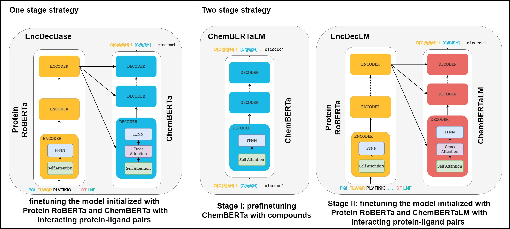

# Exploiting Pretrained Biochemical Language Models for Targeted Drug Design

## About

This repository contains code for "Exploiting Pretrained Biochemical Language Models for Targeted Drug Design", to appear in *Bioinformatics, Proceedings of ECCB2022*. The accompanying materials are available in [Zenodo](https://zenodo.org/record/6832146) [](https://doi.org/10.5281/zenodo.6832146)



## Installation
Install the required packages with pip:
```bash
pip install -r requirements.txt
```

## Training 

### ChemBERTaLM

To train ChemBERTaLM model, first save MOSES data splits on disk with the following command:

```bash
python src/data/download_moses_data.py
```

Then, train the model with the script below:

```bash
python src/molecular_training.py --model_name_or_path seyonec/PubChem10M_SMILES_BPE_450k \
--evaluation_strategy epoch --train_file data/moses/train.txt --validation_file data/moses/test.txt \
--do_train --do_eval --output_dir models/ChemBERTaLM --block_size 256 --save_strategy epoch --num_train_epochs 10
```

Once training is completed, sample 30K molecules from ChemBERTaLM and benchmark it against MOSES

```bash
python src/molecular_generation.py --model models/ChemBERTaLM --num_return_sequences 30000 --do_sample
python src/molecular_evaluation.py --model models/ChemBERTaLM
```

### Target Specific Models

Training target specific models require protein-ligand interactions from BindingDB. Data must be first prepared by following instructions described in `notebooks/` or downloaded from [corresponding Zenodo repository](https://zenodo.org/record/6832146)

Targeted generative models can be then finetuned with initializing from ProteinRoBERTa and ChemBERTa variants (ChemBERTaLM or the original ChemBERTa)
```bash
python src/targeted_training.py --output_dir models/EncDecLM \
--protein_model ProteinRoBERTa --ligand_model ChemBERTaLM \
--num_train_epochs 10
```

The baseline model T5 can be trained from scratch with the following snippet:
```bash
python src/targeted_training.py  --output_dir models/T5 --num_train_epochs 20
```

After training, molecules targeting validation and test proteins can be generated by specifying the trained model path:
```bash
python src/targeted_generation.py --model models/EncDecLM
```

Next, benchmarking metrics can be computed as follows:
```bash
python src/targeted_evaluation.py --model models/EncDecLM
```

### Docking 

Generated molecules can be further evaluated with performing docking. This requires installation of additional packages: `OpenBabel`, `PyMol` and `gnina`. `OpenBabel` and `PyMol` can be downloaded by conda & pip package managers as follows:

```bash
conda install -c openbabel openbabel
conda install -c schrodinger pymol-bundle
pip install py3Dmol
```
To install `gnina`, please refer to [the official documentation](https://github.com/gnina/gnina).

To perform docking for a protein of interest, its 3D structure in complex with a ligand is needed. Such structures can be chosen from [PDB](https://www.rcsb.org/).

To dock a protein whose structure is already defined against a set of molecules, you can execute the command below by giving UniProt ID of the protein and the path of the sdf file storing molecules:
```bash
python src/run_docking.py --uniprot_id {protein_uniprot_id} --mol_file {path_to_sdf}
```

One can also provide PDB ID of a protein structure and ID of the ligand in complex with that protein instead of UniProt ID:

```bash
python src/run_docking.py --target_pdb_id {PDB_ID} --ligand_id {ligand_ID} --mol_file {path_to_sdf}
```

## Citation

```
@article{10.1093/bioinformatics/btac482,
    author = {Uludoğan, Gökçe and Ozkirimli, Elif and Ulgen, Kutlu O. and Karalı, Nilgün Lütfiye and Özgür, Arzucan},
    title = "{Exploiting Pretrained Biochemical Language Models for Targeted Drug Design}",
    journal = {Bioinformatics},
    year = {2022},
    doi = {10.1093/bioinformatics/btac482},
    url = {https://doi.org/10.1093/bioinformatics/btac482}
}
```

